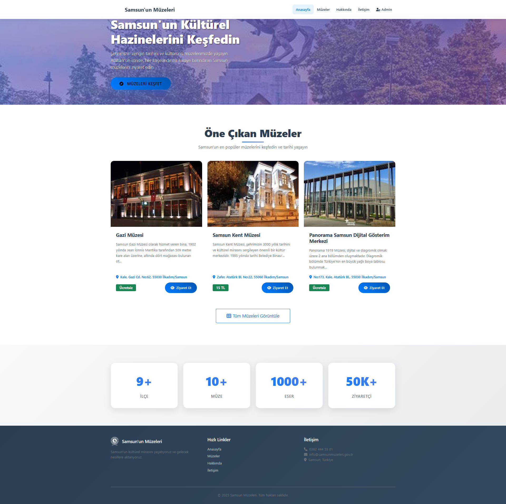
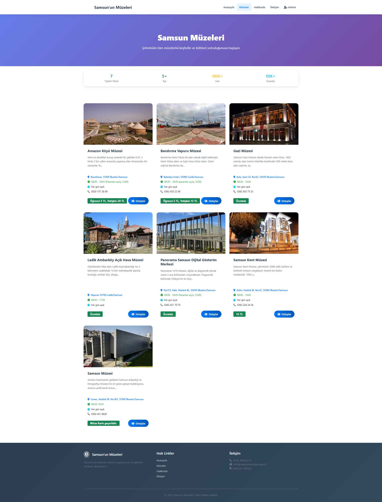
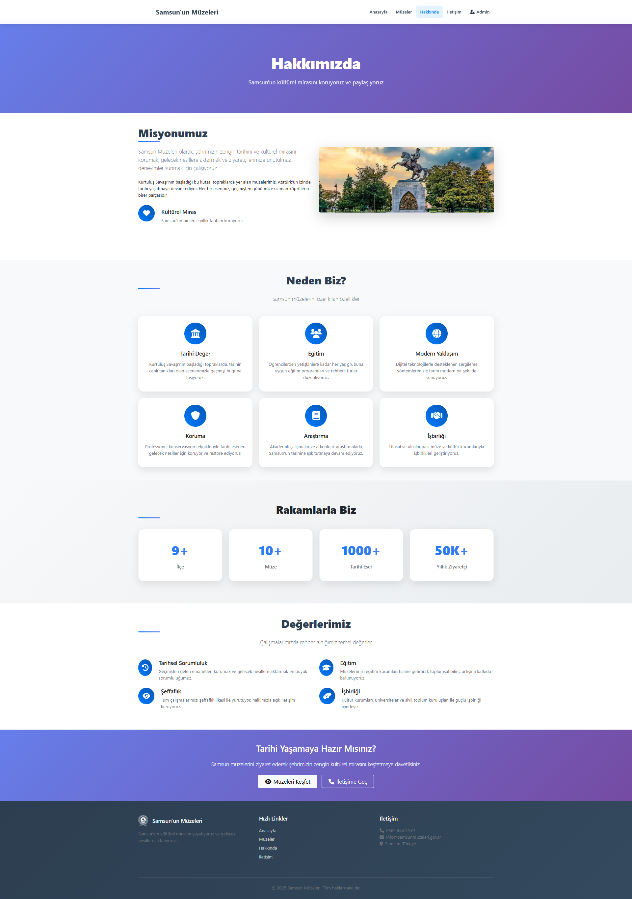
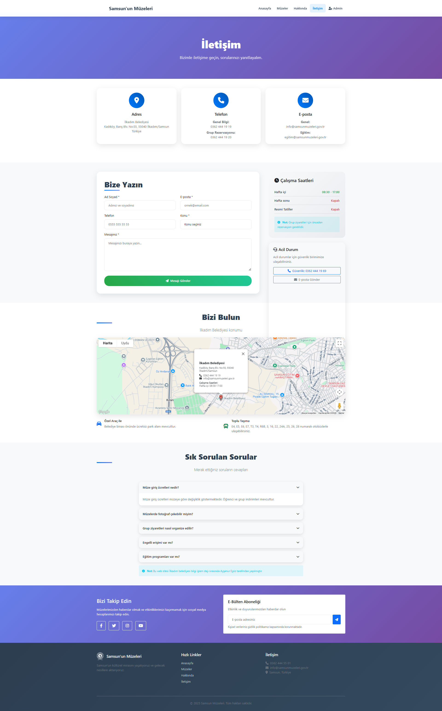
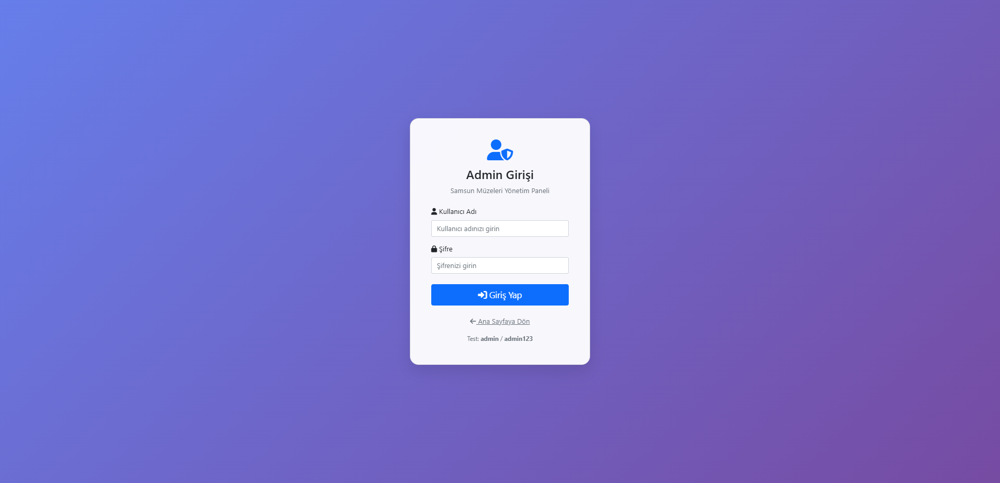
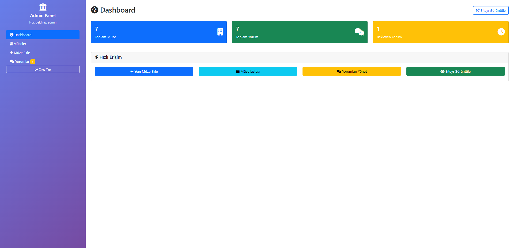
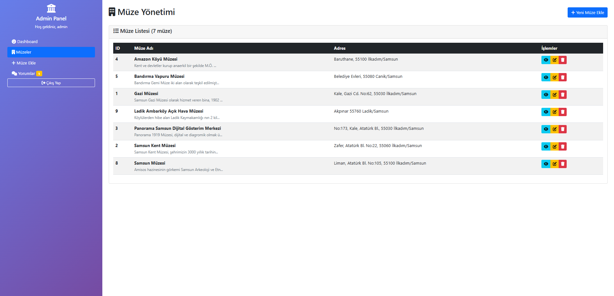
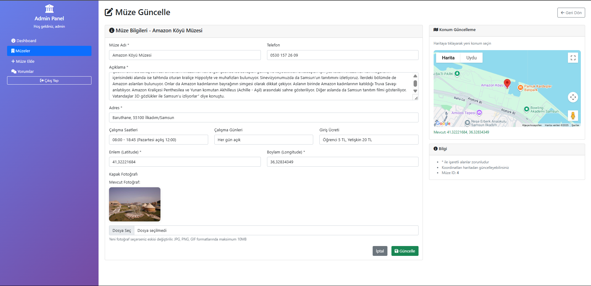
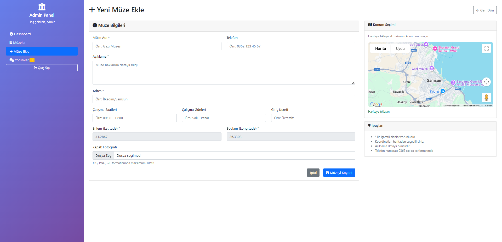
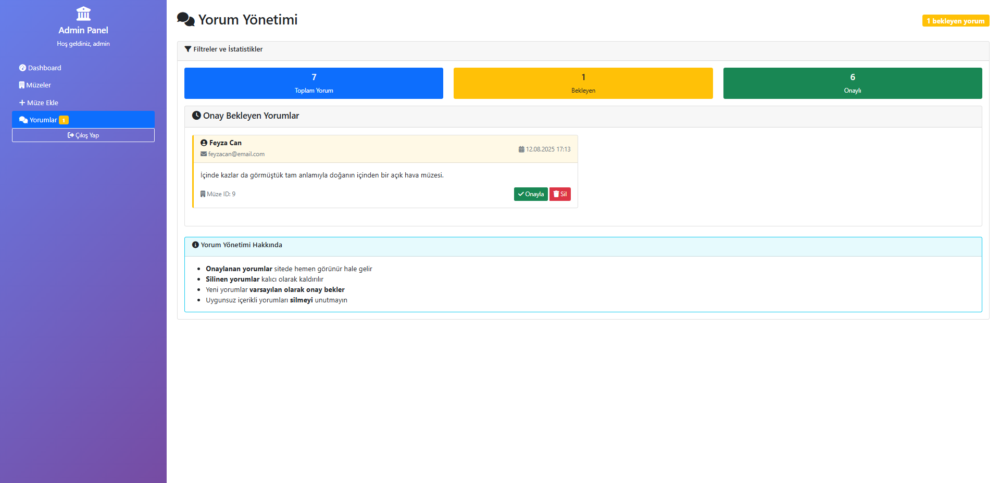

# Samsun'un Müzeleri

Samsun ilindeki müzeleri tanıtan ve yöneten modern bir Java Web uygulaması.

## 📋 Proje Hakkında

Bu proje, Samsun'daki müzeleri kullanıcılara tanıtmak ve admin paneli üzerinden müze bilgilerini yönetmek amacıyla geliştirilmiş bir web uygulamasıdır. Kullanıcılar müzeleri görüntüleyebilir, detaylarını inceleyebilir ve yorum yapabilir. Admin kullanıcılar ise müze bilgilerini ekleyebilir, silebilir, düzenleyebilir ve kullanıcı yorumlarını yönetebilir.

## 🚀 Özellikler

### Kullanıcı Tarafı
- **Ana Sayfa**: Atatürk anıtı ile etkileyici giriş sayfası
- **Müze Listesi**: Tüm müzelerin listelendiği sayfa
- **Müze Detayları**: Her müze için detaylı bilgi sayfası
- **Yorum Sistemi**: Kullanıcıların müzelere yorum yapabilmesi
- **Hakkında Sayfası**: Proje hakkında bilgiler
- **İletişim Sayfası**: İletişim bilgileri

### Admin Paneli
- **Dashboard**: İstatistikler ve genel bakış
- **Müze Yönetimi**: Müze ekleme, düzenleme, silme
- **Yorum Yönetimi**: Kullanıcı yorumlarını onaylama/reddetme
- **Güvenli Giriş**: Admin kullanıcı girişi
- 
Bu proje için ekran görüntüleri:

### Ana Sayfa


### Müzeler Sayfası


### Müze Detay Sayfası


### Hakkımızda Sayfası


### İletişim Sayfası


### Admin Giriş Sayfası


### Admin Dashboard Sayfası


### Admin Müzeler Sayfası


### Admin Müze Güncelle Sayfası


### Admin Müze Ekle Sayfası


### Admin Yorumlar Sayfası



### Uygulamaya Erişim
- **Admin Paneli**: 
  - Kullanıcı adı: `admin`
  - Şifre: `admin123`
 
    
## 🛠️ Teknolojiler

- **Backend**: Java 17, Servlet, JSP
- **Veritabanı**: MySQL 8.0
- **Frontend**: Bootstrap 5, Font Awesome
- **Build Tool**: Maven
- **Server**: Apache Tomcat

## 📦 Kurulum

### Gereksinimler
- Java 17 veya üzeri
- Maven 3.6+
- MySQL 8.0
- Apache Tomcat 9.0+


## 📁 Proje Yapısı

```
SamsununMuzeleri/
├── src/
│   ├── main/
│   │   ├── java/com/
│   │   │   ├── dao/          # Veri erişim katmanı
│   │   │   ├── model/        # Veri modelleri
│   │   │   ├── servlet/      # Controller katmanı
│   │   │   └── util/         # Yardımcı sınıflar
│   │   └── webapp/
│   │       ├── css/          # Stil dosyaları
│   │       ├── images/       # Resim dosyaları
│   │       ├── jsp/          # JSP sayfaları
│   │       └── WEB-INF/      # Web konfigürasyonu
├── pom.xml                   # Maven konfigürasyonu
└── README.md                 # Bu dosya
```

## 🔧 Konfigürasyon

### Web.xml Ayarları
- UTF-8 karakter kodlaması
- Statik kaynak mapping (CSS, JS, resimler)
- Session timeout: 30 dakika
- Hata sayfaları tanımlanmış

### Güvenlik
- Admin paneli için session kontrolü
- SQL injection koruması (PreparedStatement kullanımı)
- XSS koruması (JSTL kullanımı)

## 🎨 Tasarım Özellikleri

- **Responsive Tasarım**: Mobil uyumlu
- **Modern UI**: Bootstrap 5 ile modern görünüm
- **Türkçe Arayüz**: Tamamen Türkçe kullanıcı arayüzü
- **İkonlar**: Font Awesome ikonları
- **Gradient Efektler**: Modern görsel efektler

## 📝 Lisans

Bu proje eğitim amaçlı geliştirilmiştir.

## 🤝 Katkıda Bulunma

1. Bu repository'yi fork edin
2. Yeni bir branch oluşturun (`git checkout -b feature/yeni-ozellik`)
3. Değişikliklerinizi commit edin (`git commit -am 'Yeni özellik eklendi'`)
4. Branch'inizi push edin (`git push origin feature/yeni-ozellik`)
5. Pull Request oluşturun

## 📞 İletişim

Proje hakkında sorularınız için issue açabilirsiniz. 
