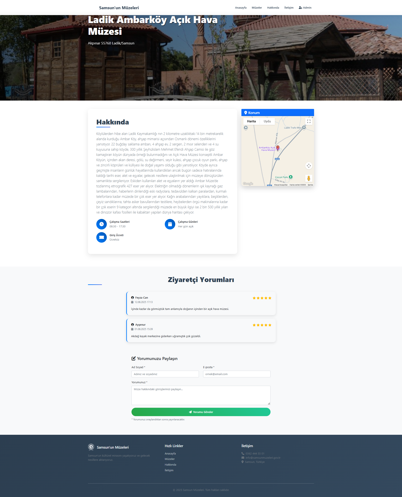

# Samsun'un Müzeleri

Samsun ilindeki müzeleri tanıtan ve yöneten modern bir Java Web uygulaması.

## 📋 Proje Hakkında

Bu proje, Samsun'daki müzeleri kullanıcılara tanıtmak ve admin paneli üzerinden müze bilgilerini yönetmek amacıyla geliştirilmiş bir web uygulamasıdır. Kullanıcılar müzeleri görüntüleyebilir, detaylarını inceleyebilir ve yorum yapabilir. Admin kullanıcılar ise müze bilgilerini ekleyebilir, silebilir, düzenleyebilir ve kullanıcı yorumlarını yönetebilir.

## 🚀 Özellikler

### Kullanıcı Tarafı
- **Ana Sayfa**: Atatürk anıtı ile etkileyici giriş sayfası
- **Müze Listesi**: Tüm müzelerin listelendiği sayfa
- **Müze Detayları**: Her müze için detaylı bilgi sayfası
- **Yorum Sistemi**: Kullanıcıların müzelere yorum yapabilmesi
- **Hakkında Sayfası**: Proje hakkında bilgiler
- **İletişim Sayfası**: İletişim bilgileri

### Admin Paneli
- **Dashboard**: İstatistikler ve genel bakış
- **Müze Yönetimi**: Müze ekleme, düzenleme, silme
- **Yorum Yönetimi**: Kullanıcı yorumlarını onaylama/reddetme
- **Güvenli Giriş**: Admin kullanıcı girişi
  
Bu proje için ekran görüntüleri:

### Ana Sayfa


### Müzeler Sayfası


### Müze Detay Sayfası


### Hakkımızda Sayfası


### İletişim Sayfası


### Admin Giriş Sayfası


### Admin Dashboard Sayfası


### Admin Müzeler Sayfası


### Admin Müze Güncelle Sayfası


### Admin Müze Ekle Sayfası


### Admin Yorumlar Sayfası


### Uygulamaya Erişim
- **Admin Paneli**: 
  - Kullanıcı adı: `admin`
  - Şifre: `admin123`
 
    
## 🛠️ Teknolojiler

- **Backend**: Java 17, Servlet, JSP
- **Veritabanı**: MySQL 8.0
- **Frontend**: Bootstrap 5, Font Awesome
- **Build Tool**: Maven
- **Server**: Apache Tomcat

## 📦 Kurulum

### Gereksinimler
- Java 17 veya üzeri
- Maven 3.6+
- MySQL 8.0
- Apache Tomcat 9.0+


### Adım 1: Veritabanı Kurulumu

Proje kök dizinindeki `database.sql` dosyasını kullanarak veritabanını oluşturun:

```bash
# MySQL'e bağlanın
mysql -u root -p

# SQL dosyasını çalıştırın
source database.sql;
```

Veya MySQL Workbench gibi bir GUI aracı kullanarak `database.sql` dosyasını import edebilirsiniz.

**Not**: Bu SQL dosyası otomatik olarak:
- `samsunmuzeleri` veritabanını oluşturur
- Gerekli tüm tabloları (müzeler, yorumlar, admin_users, iletisim_mesajlari) oluşturur

### Adım 2: Veritabanı Bağlantısı
`src/main/java/com/util/DatabaseConnection.java` dosyasında veritabanı bilgilerini güncelleyin:
```java
private static final String URL = "jdbc:mysql://localhost:3306/samsunmuzeleri?useSSL=false&serverTimezone=UTC";
private static final String USERNAME = "root";
private static final String PASSWORD = "your_password";
```

### Adım 3: Google Maps API Key
Projede Google Maps entegrasyonu bulunmaktadır. Harita özelliklerinin çalışması için:

1. [Google Cloud Console](https://console.cloud.google.com/)'a gidin
2. Yeni bir proje oluşturun veya mevcut projenizi seçin
3. Maps JavaScript API'yi etkinleştirin
4. API Key oluşturun
5. Aşağıdaki dosyalarda `YOUR-API-KEY` yerine kendi API key'inizi yazın:
   - `src/main/webapp/jsp/iletisim.jsp`
   - `src/main/webapp/jsp/admin-muze-ekle.jsp`
   - `src/main/webapp/jsp/admin-muze-guncelle.jsp`
   - `src/main/webapp/jsp/muze-detay.jsp`
   - `src/main/webapp/jsp/muzeler.jsp`

**Not**: API key'inizi güvenlik için environment variable olarak da kullanabilirsiniz.

### Adım 4: Projeyi Derleme ve Çalıştırma
```bash
# Projeyi derleyin
mvn clean package

# WAR dosyasını Tomcat'e kopyalayın
cp target/SamsununMuzeleri-0.0.1-SNAPSHOT.war $TOMCAT_HOME/webapps/

# Tomcat'i başlatın
$TOMCAT_HOME/bin/startup.sh
```


## 📁 Proje Yapısı

```
SamsununMuzeleri/
├── src/
│   ├── main/
│   │   ├── java/com/
│   │   │   ├── dao/          # Veri erişim katmanı
│   │   │   ├── model/        # Veri modelleri
│   │   │   ├── servlet/      # Controller katmanı
│   │   │   └── util/         # Yardımcı sınıflar
│   │   └── webapp/
│   │       ├── css/          # Stil dosyaları
│   │       ├── images/       # Resim dosyaları
│   │       ├── jsp/          # JSP sayfaları
│   │       └── WEB-INF/      # Web konfigürasyonu
├── pom.xml                   # Maven konfigürasyonu
└── README.md                 # Bu dosya
```

## 🔧 Konfigürasyon

### Web.xml Ayarları
- UTF-8 karakter kodlaması
- Statik kaynak mapping (CSS, JS, resimler)
- Session timeout: 30 dakika
- Hata sayfaları tanımlanmış

### Güvenlik
- Admin paneli için session kontrolü
- SQL injection koruması (PreparedStatement kullanımı)
- XSS koruması (JSTL kullanımı)

## 🎨 Tasarım Özellikleri

- **Responsive Tasarım**: Mobil uyumlu
- **Modern UI**: Bootstrap 5 ile modern görünüm
- **Türkçe Arayüz**: Tamamen Türkçe kullanıcı arayüzü
- **İkonlar**: Font Awesome ikonları
- **Gradient Efektler**: Modern görsel efektler

## 📝 Lisans

Bu proje eğitim amaçlı geliştirilmiştir.

## 🤝 Katkıda Bulunma

1. Bu repository'yi fork edin
2. Yeni bir branch oluşturun (`git checkout -b feature/yeni-ozellik`)
3. Değişikliklerinizi commit edin (`git commit -am 'Yeni özellik eklendi'`)
4. Branch'inizi push edin (`git push origin feature/yeni-ozellik`)
5. Pull Request oluşturun

## 🚀 Canlıya Alma (Deployment)

### Railway ile Deployment (Önerilen)

1. **Railway'e Giriş:**
   - [Railway.app](https://railway.app/)'e gidin
   - GitHub hesabınızla giriş yapın

2. **Proje Oluşturma:**
   - "New Project" → "Deploy from GitHub repo"
   - Bu repository'yi seçin

3. **Environment Variables Ekleme:**
   ```
   DATABASE_URL=jdbc:mysql://your-railway-mysql-url:3306/samsunmuzeleri
   DATABASE_USERNAME=your_username
   DATABASE_PASSWORD=your_password
   PORT=8080
   ```

4. **MySQL Add-on Ekleme:**
   - "New" → "Database" → "MySQL"
   - Oluşturulan MySQL URL'sini DATABASE_URL'ye kopyalayın

5. **Deploy:**
   - Railway otomatik olarak deploy edecek
   - URL'niz: `https://your-app-name.railway.app`

### Render ile Deployment

1. **Render'e Giriş:**
   - [Render.com](https://render.com/)'a gidin
   - GitHub hesabınızla giriş yapın

2. **Web Service Oluşturma:**
   - "New" → "Web Service"
   - GitHub repo'nuzu bağlayın

3. **Konfigürasyon:**
   - **Build Command:** `mvn clean package`
   - **Start Command:** `java -jar target/SamsununMuzeleri-0.0.1-SNAPSHOT.war`
   - **Environment Variables:** Yukarıdaki gibi

4. **Deploy:**
   - Render otomatik olarak deploy edecek

### Oracle Cloud Free Tier

1. **Oracle Cloud Hesabı:**
   - [Oracle Cloud](https://www.oracle.com/cloud/free/)'a kayıt olun
   - Always Free tier seçin

2. **VM Instance Oluşturma:**
   - Ubuntu 20.04 seçin
   - Java 17 kurun: `sudo apt install openjdk-17-jdk`

3. **MySQL Kurulumu:**
   ```bash
   sudo apt install mysql-server
   sudo mysql_secure_installation
   ```

4. **Uygulama Deployment:**
   ```bash
   git clone https://github.com/your-username/SamsununMuzeleri.git
   cd SamsununMuzeleri
   mvn clean package
   java -jar target/SamsununMuzeleri-0.0.1-SNAPSHOT.war
   ```

## 📞 İletişim

Proje hakkında sorularınız için issue açabilirsiniz. 
